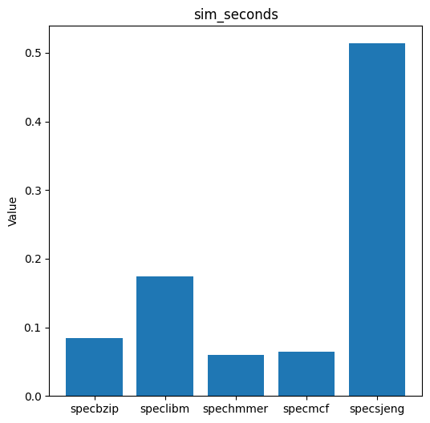
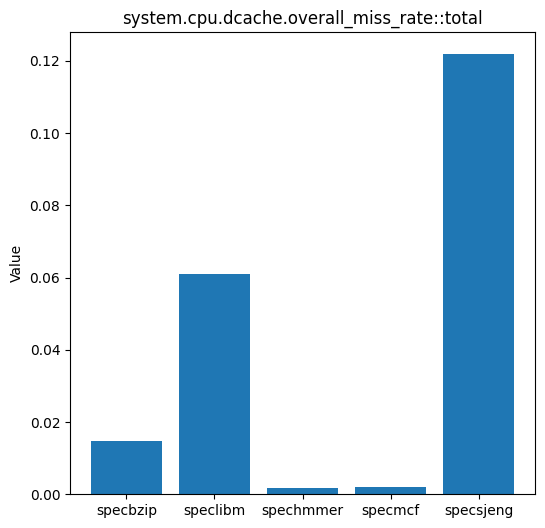
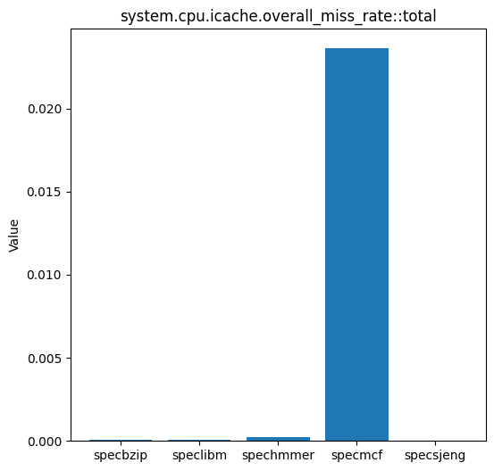
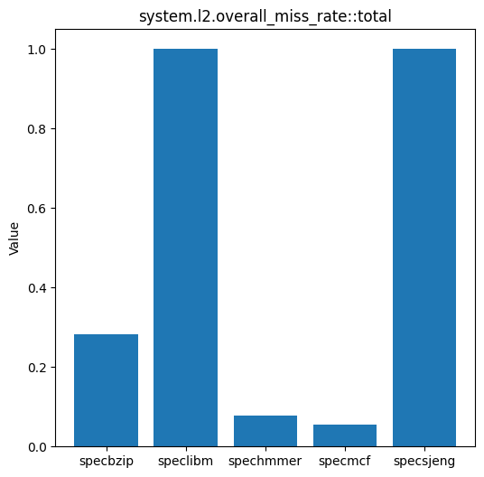
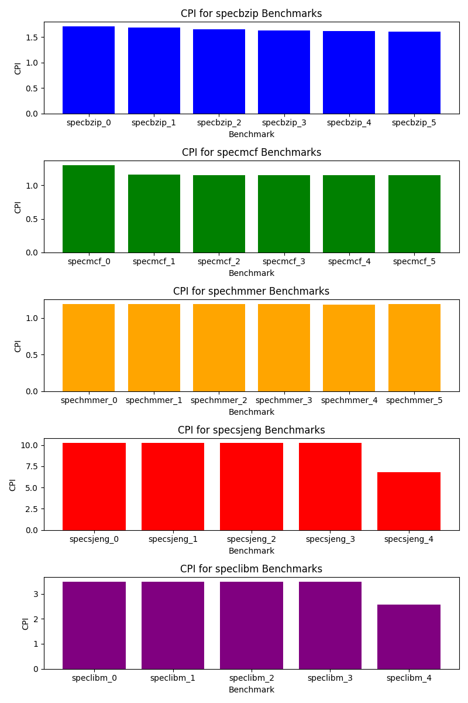
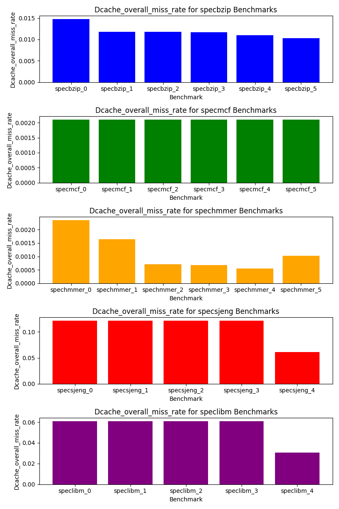
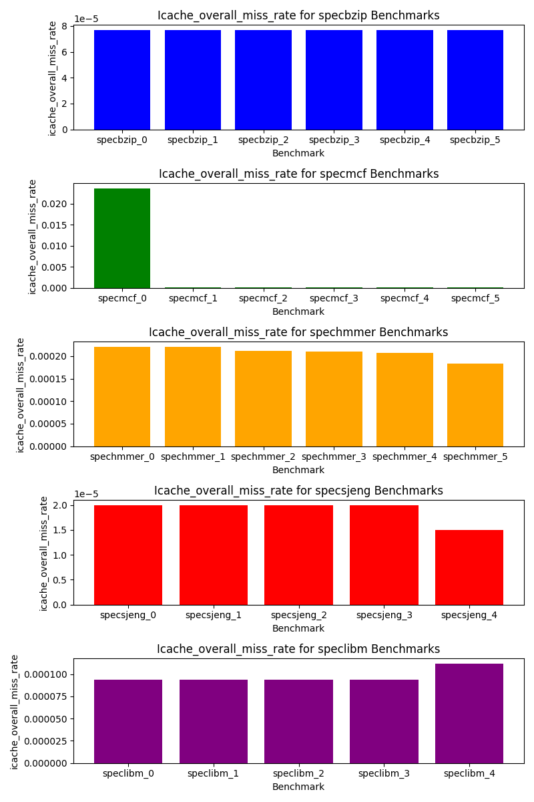
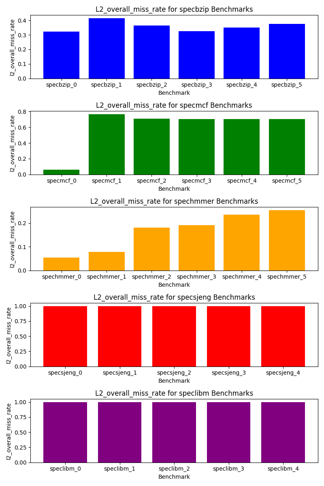

# Αρχιτεκτονική Υπολογιστών ΑΠΘ 2023-2024
## _Πουλή Αικατερίνη, ΑΕΜ:7967, e-mail: aikapoul@ece.auth.gr_
### **ΜΕΡΟΣ ΠΡΩΤΟ**
#### **Ερώτημα 1**
Κοιτάζοντας το αρχείο **starter_se.py** εξάγουμε τα εξής δεδομένα:
* Τύπος CPU (CPU Type): AtomicSimpleCPU
* Συχνότητα CPU (CPU Frequency): 1GHz
* Αριθμός Πυρήνων CPU (Number of CPU Cores): 1
* Τύπος Μνήμης (Memory type): DDR3_1600_8x8
* Αριθμός Καναλιών Μνήμης (Number of Memory Channels): 2
* Αριθμός Ranks Μνήμης ανά Κανάλι (Number of Memory Ranks per Channel): None
* Φυσικό Μέγεθος Μνήμης (Physical Memory Size): 2GB
* Τάση συστήματος (VoltageDomain): 3.3V
  
#### **Ερώτημα 2**
#### _Υποερώτημα α_
Όσον αφορά τα αρχεία **_config.ini_** και **_config.json_** εξάγουν τα ίδια αποτελέσματα με διαφορετική μορφή. Για ευκολία χρησιμοποιείται το **_config.ini_** και εξάγονται τα εξής:
* Τύπος CPU: Minor (type=MinorCPU)
* Συχνότητα CPU: 1Ghz (clock=1000)
* Αριθμός Πυρήνων CPU:1 (numThreads=1)
* Τύπος Μνήμης: DDR3_1600_8x8 (Μετά από ψάξιμο στα config)
* Αριθμός Καναλιών Μνήμης: 2 (system.mem_ctrls0 & system.mem_ctrls1)
* Αριθμός Ranks Μνήμης ανά Κανάλι: 2 (ranks_per_channel=2 για κάθε module)
* Φυσικό Μέγεθος Μνήμης: 2GB (mem_ranges=0:2147483647/1024*1024)
* Τάση συστήματος: 3.3V (voltage=3.3)
* Σχετικά με τους caches: Έχουμε L1d και L1i για δεδομένα και εντολές αντίστοιχα[2], L2 και walkcache. To L1d (dcache) έχει μέγεθος 32768 = 32 KB (size=32768) και το L1i 49152 = 48KB size=49152. Το walker_cache έχει
μέγεθος 1ΚΒ (size=1024) και το L2 1MB (size=1048576).

#### _Υποερώτημα b_
* sim_seconds: 0.000035 (sec) Αναφέρεται στον συνολικό χρόνο προσομοίωσης σε δευτερόλεπτα. Είναι ένας δείκτης του συνολικού χρόνου που έχει παρέλθει κατά τη διάρκεια της προσομοίωσης.

* sim_insts: 5027(insts) Προσδιορίζει τον συνολικό αριθμό των εντολών (instructions) που εκτελέστηκαν κατά τη διάρκεια της προσομοίωσης. Είναι ένας μετρητής για τον συνολικό όγκο εργασίας που επιτελέστηκε από το σύστημα.

* host_inst_rate: 86201 (inst/sec) Προσδιορίζει το ρυθμό εκτέλεσης εντολών στον υπολογιστικό κόμβο (host) κατά τη διάρκεια της προσομοίωσης. Συνήθως μετριέται σε εντολές ανά δευτερόλεπτο και παρέχει πληροφορίες σχετικά
με την απόδοση της προσομοίωσης σε επίπεδο υπολογιστικού κόμβου.

#### _Υποερώτημα c_
Βάσει του *stats.txt* συνολικά έχουμε 5028 committed instructions (_system.cpu_cluster.cpus.committedInsts_), ενώ 5831 commited ops (_system.cpu_cluster.cpus.committedOps_). Η διαφορά προκύπτει από το γεγονός ότι οι
εντολές που στέλνονται προς τη CPU για εκτέλεση δεν έχουν 1-προς-1 αντιστοιχία με τα πραγματικά "micro-operations" που εκτελεί ο επεξεργαστής στο υλικό του. Με άλλα λόγια, μία εντολή από την ISA της CPU μπορεί να απαιτεί
παραπάνω από ένα micro-operation για να εκτελεστεί.

#### _Υποερώτημα d_
Συνολικά η L2 cache προσπελάστηκε 474 φορές, όπως φαίνεται και από την καταχώρηση system.cpu_cluster.l2.overall_accesses::total 474   στο status.txt. Οι προσπελάσεις της L2 μπορούν να υπολογιστούν έμμεσα από τα misses
της L1i L1d (dcache και icache):
system.cpu_cluster.cpus.dcache.demand_mshr_misses::total  147 και system.cpu_cluster.cpus.icache.demand_misses::.cpu_cluster.cpus.inst  327. Σύνολο δηλαδή: 147 + 327 = 474

#### **Ερώτημα 3 - Βιβλιογραφική έρευνα**
Παρακάτω παραθέτω μια συνοπτική περιγραφή για ένα ακόμα μοντέλο:
1. MinorCPU:
    * Το MinorCPU είναι ένα in-order μοντέλο CPU που παρέχει υψηλή ακρίβεια στην προσομοίωση.
    * Υποστηρίζει εξελιγμένες λειτουργίες όπως ο speculative εκτελεστής και η προσομοίωση αποτυχιών.
    * Κατάλληλο για λεπτομερείς αναλύσεις απόδοσης.
2. SimpleCPU:
   * Το SimpleCPU είναι ένα απλό in-order μοντέλο CPU που προσφέρει βασική λειτουργικότητα για την προσομοίωση.
   * Δεν υποστηρίζει πολυνηματική εκτέλεση και είναι κατάλληλο για γρήγορες προσομοιώσεις.
3. AtomicSimpleCPU:
    * Το AtomicSimpleCPU είναι ένα in-order μοντέλο CPU που χρησιμοποιείται για απλές προσομοιώσεις.
    * Διαφέρει από το SimpleCPU στον τρόπο υλοποίησης του και παρέχει περιορισμένη λειτουργικότητα για την επίτευξη υψηλών επιδόσεων.
4. TimingSimpleCPU:
    * Το TimingSimpleCPU είναι ένα in-order μοντέλο CPU που προσομοιώνει τις καθυστερήσεις χρονισμού.
    * Χρησιμοποιείται για προσομοιώσεις που απαιτούν ακριβή μοντελοποίηση του χρονισμού εκτέλεσης.
  
  
#### _Υποερώτημα α_
|   | MinorCPU  | TimingSimpleCPU  |
|---|---|---|
|  Number of Ticks |  32204000 |  36631000  |
|  Simulation seconds   | 0.000032  |  0.000037  |
|  Number of CPU cycles | 64408  |  73262  | 
|  Number of committed instructions | 8442  |  8390  | 
|  CPI (cycles per instruction) |  7.6295  |  8.7321 |

#### _Υποερώτημα b_
Παρατηρούμε ότι ο _TimingSimpleCPU_ είναι κατά 15,63% πιο αργός από τον _MinorCPU_ για την εκτέλεση του ίδιου προγράμματος. Αυτή η διαφορά οφείλεται στο γεγονός ότι ο _TimingSimpleCPU_ δε διαθέτει κάποιο pipeline, ενώ επίσης λαμβάνει υπόψη του και τις καθυστερήσεις στο
queueing των εντολών και μέσα στην cache, εκτός από αυτές που προκύπτουν αποκλειστικά λόγω της μεταφοράς δεδομένων από τη RAM στην cache.

#### _Υποερώτημα c_

### CPU clock: 100MHz
|   | MinorCPU  | TimingSimpleCPU  |
|---|---|---|
|  Number of Ticks |  171920000 |  285650000  |
|  Simulation seconds   | 0.000172  |  0.000286  |
|  Number of CPU cycles | 17192  |  28565  | 
|  Number of committed instructions | 8442  |  8390  | 
|  CPI (cycles per instruction) |  8.6783  |  3.4047 |

### Memory type: DDR4_2400_8x8
|   | MinorCPU  | TimingSimpleCPU  |
|---|---|---|
|  Number of Ticks |  30643000 |  36023000  |
|  Simulation seconds   | 0.000031  |  0.000036  |
|  Number of CPU cycles | 61286  |  72046  | 
|  Number of committed instructions | 8442  |  8390  | 
|  CPI (cycles per instruction) |  7.2597  |  8.5871 |

Όπως παρατηρούμε, σε όλες τις περιπτώσεις ο _MinorCPU_ τρέχει πιο γρήγορα από τον _TimingSimpleCPU_  και αυτό μπορούμε να το αποδώσουμε στο γεγονός ότι στον _MinorCPU_ υπάρχει το pipeline, συνεπώς δεν χρειάζεται να περιμένει να τελειώσει η προσπέλαση της μνήμης πριν
συνεχίσει στην επόμενη εντολή. Η ίδια παρατήρηση γίνεται και από τον αριθμό των ticks σε κάθε περίπτωση.

Ο αριθμός των instructions και στα δύο μοντέλα είναι σχεδόν ίδιος. Αντίθετα ο αριθμός των CPU cycles έχει μια αισθητή διαφορά και αυτό οφείλεται στο ότι ο TimingSimpleCPU χρησιμοποιεί timing memory access, άρα
χρειάζονται περισσότεροι κύκλοι. 
Όταν αλλάζουμε την συχνότητα από τα 1GHz σε 0.1GHz παρατηρούμε ότι αυξάνονται ο αριθμός των ticks, ο χρόνος εκτέλεσης και ο αριθμός των CPU cycles. Τέτοιο αποτέλεσμα είναι απολύτως λογικό. 
Τέλος με την αλλαγή της τεχνολογίας της μνήμης σε DDR4, αναμένουμε όλα τα νούμερα να είναι μικρότερα, κάτι το οποίο επαληθεύεται από τις πειραματικές μετρήσεις, αλλά η διαφορά είναι μικρή που δικαιολογείται από το
γεγονός ότι η μνήμη RAM τεχνολογίας DDR4 είναι πάλι πιο αργή από την cache του επεξεργαστή, αν και πιο γρήγορη από τη DDR3. Ο αριθμός των Instructions παρατηρούμε ότι δεν αλλάζει, όταν αλλάζουμε τις ρυθμίσεις, καθώς το
τι πρέπει να εκτελεστεί εξαρτάται μόνο από το πρόγραμμα και όχι από τη συχνότητα και τον τύπο της μνήμης.

### **ΜΕΡΟΣ ΔΕΥΤΕΡΟ**

**_BHMA 1_**

#### **Ερώτημα 1**

|  Cache Type  |  Associativity  |  Size  |  Line size (bytes)  |
|---|---|---|---|
|  L1 Data [system.cpu.dcache]  |  2-way  |  65536  |  64  |
|  L1 instruction [system.cpu.icache]  |  2-way  |  32768  |  64  |
|  L2 [system.l2]  |  8-way  |  2097152  |  64  |

#### **Ερώτημα 2**

Βάσει των αποτελεσμάτων των benchmark, συνέλεξα τα δεδομένα σε ένα πίνακα ως εξής:

|  Benchmarks  |  sim_seconds  |  system.cpu.cpi  |  system.cpu.dcache.overall_miss_rate::total  |  system.cpu.icache.overall_miss_rate::total  |  system.l2.overall_miss_rate::total  |
|---|---|---|---|---|---|
|  specbzip  |  0.083982  |  1.679650  |  0.014798  |  0.000077  |  0.282163  |
|  speclibm  |  0.174671  |  3.493415  |  0.060972  |  0.000094  |  0.999944  |
|  spechmmer |  0.059396  |  1.187917  |  0.001637  |  0.000221  |  0.077760  |
|  specmcf  |  0.064955  |  1.299095  |  0.002108  |  0.023612  |  0.055046  |
|  specsjeng  |  0.513528  |  10.270554  |  0.121831  |  0.000020  |  0.999972  |

Ας δούμε και τα γραφήματα:

 
 
 
 

Βάσει των γραφημάτων παρατηρούμε ότι το benchmark specmcf έχει τη χειρότερη απόδοση (πολύ κακή) όσον αφορά τον ρυθμό αστοχίας της L1 i cache, όμως δεν είναι το benchmark με τη χειρότερη απόδοση (αντίθετα, επιτυγχάνει τον καλύτερο CPI). Το χειρότερο benchmark είναι το
specsjeng, το οποίο έχει τον μεγαλύτερο ρυθμό αστοχίας της L2 cache. Αυτό συμβαίνει επειδή η L2 cache είναι πολύ πιο αργή από την L1 και η έλλειψη απόδοσης σε αυτήν μπορεί να καθιστά την CPU πολύ αργή. Μπορούμε επίσης να δούμε ότι η MinorCPU κάνει εξαιρετική δουλειά
χειριζόμενη το benchmark specbzip, διατηρώντας ισορροπημένη απόδοση στη μνήμη.

#### **Ερώτημα 3**

## system.clk_domain.clock
|  Benchmarks  |  --cpu-clock=default  |  --cpu-clock=1GHz  |  --cpu-clock=default=3GHz  |
|---|---|---|---|
|  all  |  1000  |  1000  |  1000  |

## system.cpu_clk_domain.clock
|  Benchmarks  |  --cpu-clock=default  |  --cpu-clock=1GHz  |  --cpu-clock=default=3GHz  |
|---|---|---|---|
|  all  |  500  |  1000  |  333  |

To system.clk_domain.clock ισούται με 1000 ticks και στα τρία συστήματα. Αντίθετα, αυτό που μεταβάλλεται είναι το system.cpu.clk_domain.clock, το οποίο ισούται με με 500 για το default (2Ghz), με 1000 ticks για τον
επεξεργαστή στο 1 GHz και με 333 ticks σε αυτόν με 3 GHz.
Επομένως, συμπεραίνουμε ότι το CPU clock domain είναι το ρολόι του πυρήνα του επεξεργαστή, ενώ το system clock domain είναι υπεύθυνο για τη διατήρηση μιας baseline συχνότητας επικοινωνίας για όλο το υπόλοιπο σύστημα (πχ.
caches εδώ) ούτως ώστε να υπάρχει ένας συγχρονισμός και να αποφεύγεται το drifting.

Αν προσθέσουμε άλλον έναν επεξεργαστή και αν είναι σχετικά ανεξάρτητοι, τότε η συχνότητα του νέου επεξεργαστή θα παραμείνει 3000MHz (3GHz), εκτός αν υπάρχουν ειδικές ρυθμίσεις για τον δεύτερο πυρήνα.
Ως προς το scaling, δεν φαίνεται να υπάρχει τέλειο scaling. Για παράδειγμα, στην περίπτωση --cpu-clock=default=3GHz, η συχνότητα τριπλασιάζεται, αλλά ο χρόνος εκτέλεσης των benchmarks δεν μειώνεται κατά το ίδιο ποσοστό.
Αυτό οφείλεται στο γεγονός ότι  το MinorCPU χρησιμοποιεί ένα παράλληλο σύστημα εκτέλεσης και ακόμα και όταν χρησιμοποιούμε περισσότερα ρολόγια CPU στον ίδιο χρόνο συστήματος (όπως όταν προσθέτουμε έναν ακόμα
επεξεργαστή), δεν μπορούμε να παραλληλοποιήσουμε ιδανικά όλες τις διεργασίες μας.

#### **Ερώτημα 4**

|  Benchmarks  |  sim_seconds  |  system.cpu.cpi  |  system.cpu.dcache.overall_miss_rate::total  |  system.cpu.icache.overall_miss_rate::total  |  system.l2.overall_miss_rate::total  |  system.clk_domain.clock  |  system.cpu_clk_domain.clock  |
|---|---|---|---|---|---|---|---|
|  specbzip DDR3_1600_8x8  |  0.083982  |  1.679650  |  0.014798  |  0.000077  |  0.282163  |  1000  |  500  | 
|  specbzip DDR3_2133_8x8  |  0.083609  |  1.672175  |  0.014795  |  0.000077  |  0.282189  |  1000  |  500  |

Σύγκρινοντας τα αποτελέσματα των δύο εκτελέσεων του benchmark specbzip με διαφορετικές ρυθμίσεις μνήμης (DDR3_1600_8x8 και DDR3_2133_8x8), παρατηρούμε τα εξής:

1. sim_seconds (Συνολικός Χρόνος Εκτέλεσης):

    * Ο χρόνος εκτέλεσης είναι ελαφρώς μικρότερος με τη ρύθμιση DDR3_2133_8x8 (0.083609) σε σύγκριση με τη ρύθμιση DDR3_1600_8x8 (0.083982).
    * Αυτό υποδηλώνει ότι η μνήμη με υψηλότερο ρολόι (DDR3_2133) μπορεί να συμβάλει σε μια ελαφρώς βελτιωμένη συνολική απόδοση.
2. system.cpu.cpi (CPI - Cycles Per Instruction):

    * Ο μέσος αριθμός κύκλων ανά εντολή είναι σχεδόν ίδιος για τις δύο ρυθμίσεις μνήμης (περίπου 1.68).
    * Αυτό υποδηλώνει ότι η αύξηση του ρολογιού της μνήμης δεν επηρεάζει σημαντικά την απόδοση από άποψη CPI.
3. system.cpu.dcache.overall_miss_rate::total (Συνολικός Ρυθμός Αστοχίας Κρυφής Μνήμης Δεδομένων):

    * Ο συνολικός ρυθμός αστοχίας κρυφής μνήμης δεδομένων είναι σχεδόν ίδιος για τις δύο ρυθμίσεις μνήμης (περίπου 0.0148).
    * Αυτό υποδηλώνει ότι η αύξηση του ρολογιού της μνήμης δεν επηρεάζει σημαντικά το συνολικό ρυθμό αστοχίας στην κρυφή μνήμη δεδομένων.
4. system.l2.overall_miss_rate::total (Συνολικός Ρυθμός Αστοχίας Κρυφής Μνήμης L2):

    * Ο συνολικός ρυθμός αστοχίας κρυφής μνήμης L2 είναι σχεδόν ίδιος για τις δύο ρυθμίσεις μνήμης (περίπου 0.282).
    * Αυτό υποδηλώνει ότι η αύξηση του ρολογιού της μνήμης δεν επηρεάζει σημαντικά το συνολικό ρυθμό αστοχίας στην κρυφή μνήμη L2.

Οι αλλαγές στη ρύθμιση της μνήμης φαίνεται να έχουν ελάχιστη επίδραση στα χαρακτηριστικά απόδοσης του συγκεκριμένου benchmark specbzip, με την ταχύτερη μνήμη να παρέχει ελαφρώς καλύτερη συνολική απόδοση.
Στην περίπτωση του benchmark specbzip, ο χαρακτηριστικός φόρτος εργασίας μπορεί να μην εκδηλώνει σημαντική εξάρτηση από την ταχύτητα της μνήμης.

**_BHMA 2_**

#### **Ερώτημα 1**

Με βάση το πρώτο μέρος, για τα πρότυπα αρεικρισίας / benchmarks του ερωτήματος 2 επιλέχθηκαν οι ακόλουθες τιμές:

* L1 Data Cache Size: 64 kB, 128 kB
* L1 Instruction Cache Size: 32 kB, 64 kB
* L2 Cache Size: 1 MB, 2 MB, 4 MB
* L1 Data Cache Associativity: 2, 4, 8
* L1 Instruction Cache Associativity: 2, 4, 8
* L2 Cache Associativity: 4, 8
* Cache Line Size: 32 Bytes, 64 Bytes, 128 Bytes
  
Παρακάτω βλέπουμε τις δοκιμές για το κάθε benchmark, με τα παραμέτρους της καθεμιάς.

| Benchmarks   | L1\_dcache\_size | L1\_icache\_size | L2\_cache\_size | L1\_dcache\_assoc | L1\_icache\_assoc | L2\_cache\_assoc | cacheline\_size |
| ------------ | ---------------- | ---------------- | --------------- | ----------------- | ----------------- | ---------------- | --------------- |
| specbzip\_0  | 64               | 32               | 1024            | 2                 | 2                 | 4                | 64              |
| specbzip\_1  | 128              | 32               | 1024            | 2                 | 2                 | 4                | 64              |
| specbzip\_2  | 128              | 32               | 2048            | 2                 | 2                 | 4                | 64              |
| specbzip\_3  | 128              | 32               | 4096            | 2                 | 2                 | 4                | 64              |
| specbzip\_4  | 128              | 32               | 4096            | 4                 | 2                 | 4                | 64              |
| specbzip\_5  | 128              | 32               | 4096            | 8                 | 2                 | 4                | 64              |
| specmcf\_0   | 64               | 32               | 1024            | 2                 | 2                 | 8                | 64              |
| specmcf\_1   | 64               | 64               | 1024            | 2                 | 2                 | 8                | 64              |
| specmcf\_2   | 64               | 64               | 2048            | 2                 | 2                 | 8                | 64              |
| specmcf\_3   | 64               | 64               | 4096            | 2                 | 2                 | 8                | 64              |
| specmcf\_4   | 64               | 64               | 4096            | 2                 | 4                 | 8                | 64              |
| specmcf\_5   | 64               | 64               | 4096            | 2                 | 8                 | 8                | 64              |
| spechmmer\_0 | 32               | 32               | 2048            | 2                 | 2                 | 8                | 64              |
| spechmmer\_1 | 64               | 32               | 2048            | 2                 | 2                 | 8                | 64              |
| spechmmer\_2 | 128              | 32               | 2048            | 2                 | 2                 | 8                | 64              |
| spechmmer\_3 | 128              | 32               | 2048            | 4                 | 2                 | 8                | 64              |
| spechmmer\_4 | 128              | 32               | 2048            | 8                 | 2                 | 8                | 64              |
| spechmmer\_5 | 128              | 32               | 2048            | 8                 | 2                 | 8                | 32              |
| specsjeng\_0 | 64               | 32               | 2048            | 2                 | 2                 | 8                | 64              |
| specsjeng\_1 | 128              | 32               | 2048            | 2                 | 2                 | 8                | 64              |
| specsjeng\_2 | 128              | 32               | 4096            | 2                 | 2                 | 8                | 64              |
| specsjeng\_3 | 128              | 32               | 4096            | 4                 | 2                 | 8                | 64              |
| specsjeng\_4 | 128              | 32               | 4096            | 4                 | 2                 | 8                | 128             |
| speclibm\_0  | 64               | 32               | 2048            | 2                 | 2                 | 8                | 64              |
| speclibm\_1  | 128              | 32               | 2048            | 2                 | 2                 | 8                | 64              |
| speclibm\_2  | 128              | 32               | 4096            | 2                 | 2                 | 8                | 64              |
| speclibm\_3  | 128              | 32               | 4096            | 4                 | 2                 | 8                | 64              |
| speclibm\_4  | 128              | 32               | 4096            | 4                 | 2                 | 8                | 128             |

#### **Ερώτημα 2**

Ας δούμε και τα γραφήματα:

 
 
 
 
